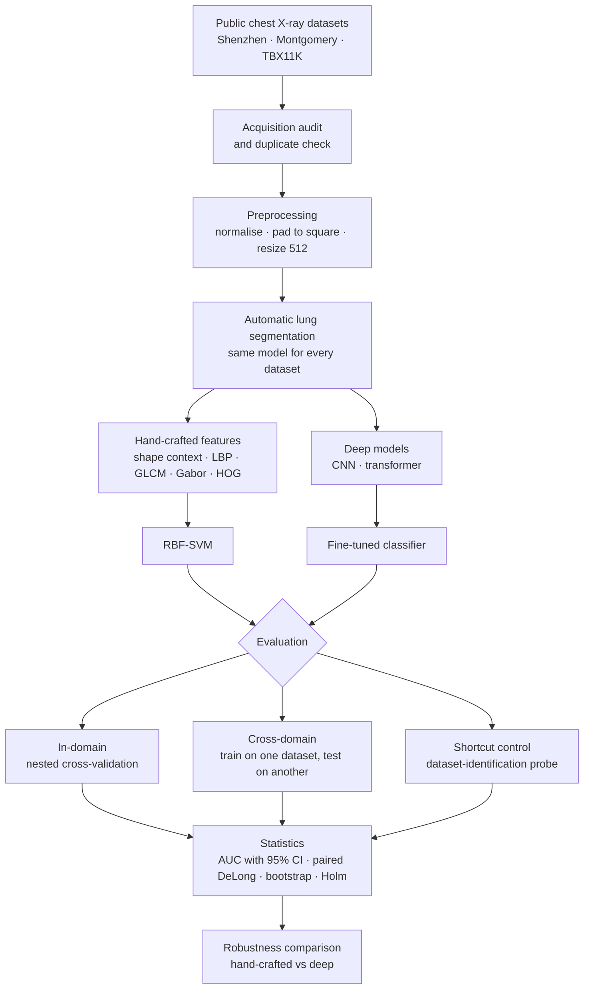

# tb-cxr-domain-shift

## Summary

Automated tuberculosis (TB) screening from chest X-rays can perform well on the dataset it was
built on, yet lose accuracy when it is used at a new site with different scanners, image
resolutions and patient populations. This project measures how much that loss happens for two
kinds of models:

- **Hand-crafted models:** thoracic edge-map shape descriptors (log-polar shape context) and
  texture descriptors (LBP, GLCM, Gabor, HOG), extracted inside automatically segmented lung
  regions and classified with an RBF support vector machine.
- **Deep models:** convolutional and transformer networks trained on the same images.

Each model is trained on one public chest X-ray collection and tested on the others, without
any tuning on the test collection. The comparison uses ROC AUC with 95% confidence intervals,
paired DeLong tests, and sensitivity and specificity at a decision threshold fixed on the
training collection. A dataset-identification probe checks whether a model is recognising the
source dataset rather than the disease. The full protocol is in
[docs/analysis_plan.md](docs/analysis_plan.md).

## Research flow

